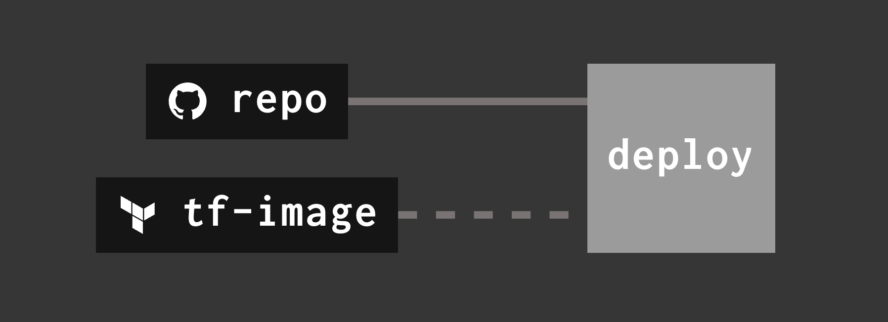
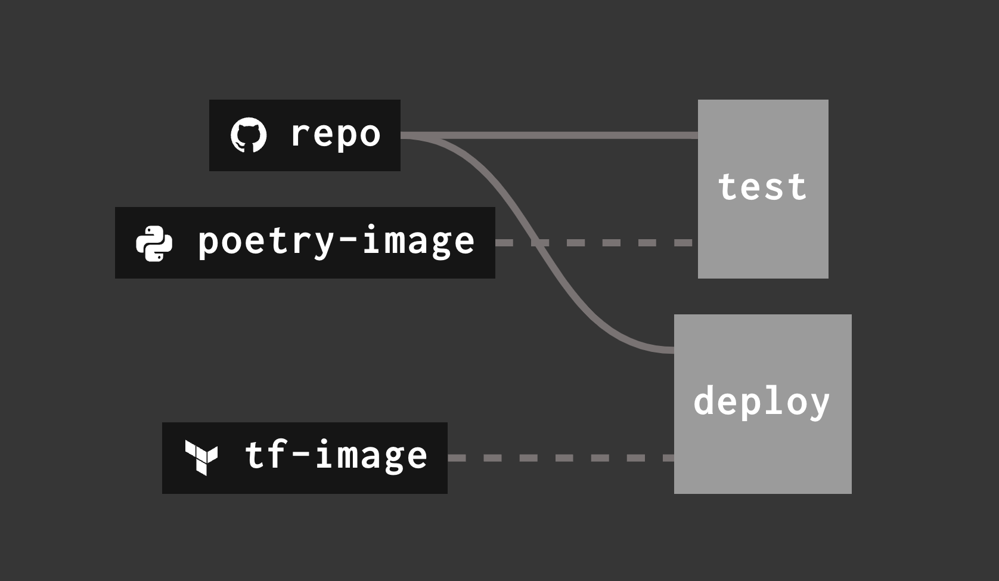
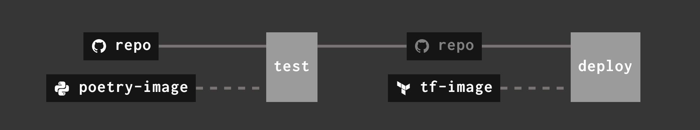
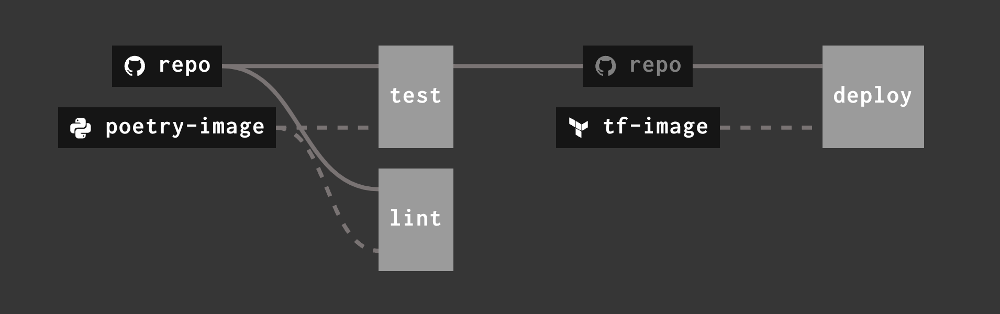
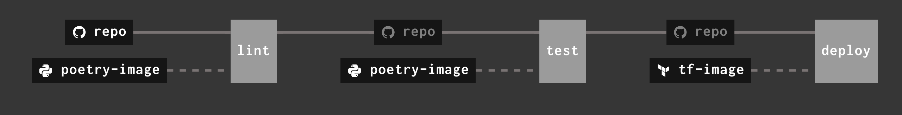
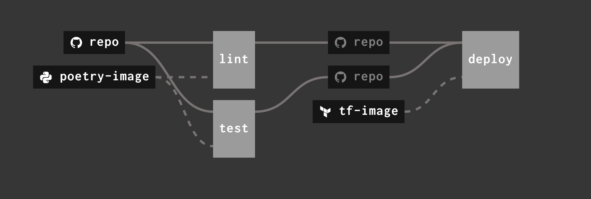

# Config Pipeline

## Deploy to production
The first goal of the workshop is to deploy the Python app to AWS, which is achieved using Terraform.
Add the following sections to the templated pipeline file, `ci/pipeline.yml`

### Resources
```yaml
# Resource for polling the GitHub repository for changes
- name: repo
  type: git
  icon: github
  source:
    uri: https://github.com/armakuni/fidelity-concourse-demo
    branch: ((branch))
```
*The branch variable here will be substituted in the `set-pipeline` command later*

```yaml
# Resource for a container with Terraform for running the deployment stages
- name: tf-image
  type: registry-image
  icon: terraform
  source:
    repository: hashicorp/terraform
```

### Task
```yaml
# Execute Terraform deployment
- task: deploy
  image: tf-image
  config:
    platform: linux
    inputs:
    - name: repo
    params:
      TF_VAR_resource_prefix: ((branch))
    run:
      path: /bin/sh
      dir: repo/terraform/lambda
      args:
      - -ec
      - |
        terraform init
        terraform workspace select ((branch)) || terraform workspace new ((branch))
        terraform apply -auto-approve
```
*The resources defined above are referenced on lines 2 and 6 of this block*

### Create concourse pipeline
With the correct YAML in place, Concourse needs to be updated to run the correct tasks
```bash
fly -t ak-concourse set-pipeline -p ci-workshop-$REPL_OWNER -c ci/pipeline.yml -l branch.name
```
*This needs to be run after each change to the pipeline YAML*

### Expose the pipeline
To see the pipeline in the Concourse UI without logging in, it can be made publicly accessble.
```bash
fly -t ak-concourse expose-pipeline -p ci-workshop-$REPL_OWNER
```
> **This is not normally done, but as Concourse is outside of the FIL network, this is done to avoid auth issues**

### Unpause the pipeline
The first time a pipeline is created in Concourse, it is in the Paused state. Run the following to unpause it and see it run
```bash
fly -t ak-concourse unpause-pipeline -p ci-workshop-$REPL_OWNER
```



### Check the result
Once the pipeline has run, find the URL of the function from the Terraform output from the `deploy` task

## Add unit tests
The workshop app also includes unit tests that should be run to highlight any issues. These should be added to the pipeline so we can be sure they are running consistently.

### Resource
```yaml
# Resource for a container with Poetry for installing dependencies and running unit tests
- name: poetry-image
  type: registry-image
  icon: language-python
  source:
    repository: fnndsc/python-poetry
```

### Task
```yaml
# Task for executing tests with Pytest. Should be a separate job
- task: unit-test
  image: poetry-image
  config:
    platform: linux
    inputs:
    - name: repo
    run:
      path: /bin/sh
      dir: repo
      args: 
      - -ec
      - |
        poetry install
        poetry run pytest
```



### Dependency
The pipeline has all the stages, but will deploy at the same time as the tests are running meaning that bad code could still get to production. We should make the deployment depend on successful tests
```yaml
# Add the following to the deployment task as a property of the repo 'get'

passed:
- test
```



## Add linting to the pipeline
We can get the pipeline to also verify that the code quality is consistent using Black and iSort. We are looking for the pipeline to fail if the code is not up to Python standards.

There are a few more commands in this task so we have moved the steps to an external script included in the repo 

### Task
```yaml
# Task for verifying code quality using black and isort
- task: lint
  image: poetry-image
  config:
    platform: linux
    inputs:
    - name: repo
    run:
      path: ci/tasks/lint/task.sh
      dir: repo
```



### Dependency
Now we have a few stages, we can figure out the best pipeline design for our situation. 
1. The pipeline could be completely linear where the tests depend on the linting passing, and the deployment depends on the tests passing.
```yaml
# The test stage can now depend on linting to be passing, update to add the lint stage
passed:
- lint
```



1. The pipeline could parallelise the linting and the testing and have the deployment depend on them both
```yaml
# The deploy stage can now depend on both testing and linting to be passing, update to add the lint stage
passed:
- test
- lint
```

